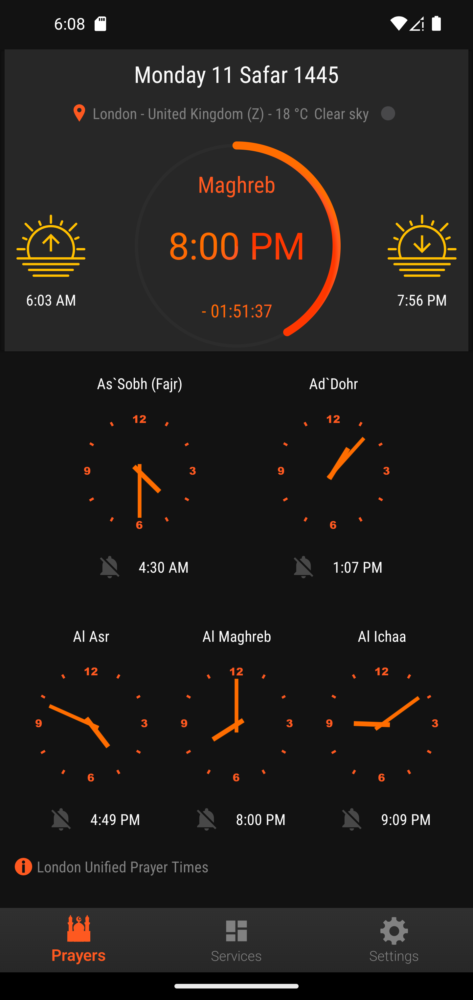
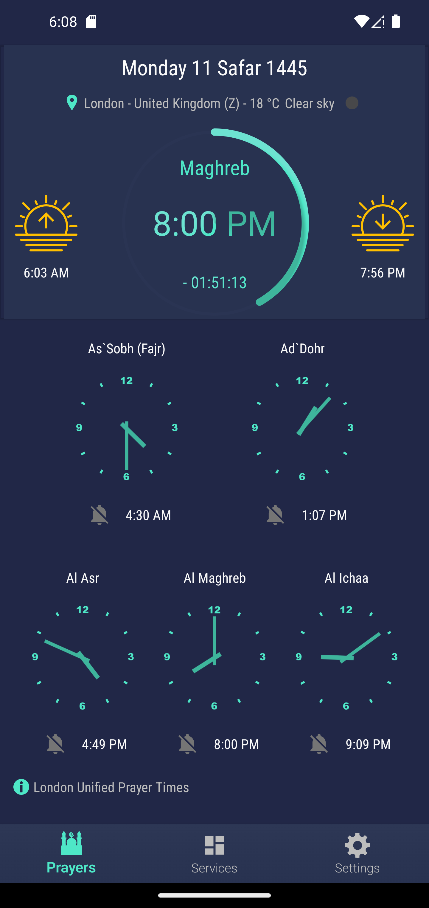
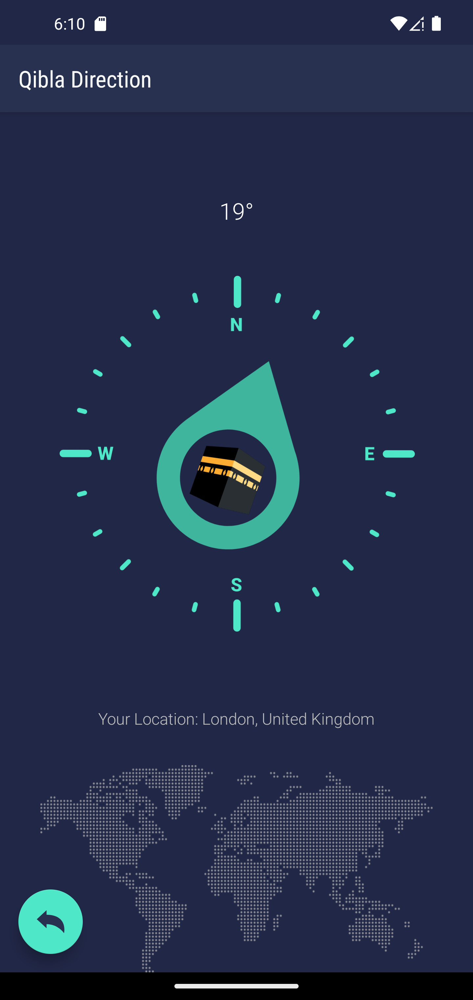

<p align="center"><a href="https://github.com/HichamBI/five-prayers-android"></a></p> 
<h2 align="center"><b>Five Prayers Android</b></h2>
<h4 align="center">A libre lightweight and ads free set of muslim tools</h4>

<p align="center">
<a href="https://github.com/Five-Prayers/five-prayers-android/actions" alt="Build Status" target="_blank"></a>
<a href="https://android-arsenal.com/api?level=16" alt="Min API: 16" target="_blank"></a>
<a href="https://www.gnu.org/licenses/gpl-3.0" alt="License: GPLv3" target="_blank"></a>
 <a href="https://github.com/Five-Prayers/five-prayers-android/branches" alt="Branches" target="_blank"></a>
<a href="https://github.com/Five-Prayers/five-prayers-android/releases/latest" alt="Download: latest version" target="_blank"></a>
<a href="https://github.com/Five-Prayers/five-prayers-android/releases/latest" alt="Download: latest version" target="_blank"></a>
<a href="https://play.google.com/store/apps/details?id=com.hbouzidi.fiveprayers" alt="Download: latest version" target="_blank"></a>
<a href="https://apt.izzysoft.de/fdroid/index/apk/com.hbouzidi.fiveprayers/" alt="Download: latest version" target="_blank"></a>
</p>

<hr>
<p align="center">
<a href="https://play.google.com/store/apps/details?id=com.hbouzidi.fiveprayers" alt="Play Store Link" target="_blank">
  
</a>

F-Droid Repos:
<br>
- Download the current version by adding the following repo to the F-Droid App
[https://raw.githubusercontent.com/Five-Prayers/fdroid-repo-stable/main/fdroid/repo](https://raw.githubusercontent.com/Five-Prayers/fdroid-repo-stable/main/fdroid/repo)

You can use this fingerprint to validate repo's signature : 

```
C8 E3 6E 27 BA 66 CB 81 D9 24 9C 55 C6 7A 8E 53 21 AF DB CC F8 1E EB 0D 49 5E 8E 3A 01 FE 16 93
```

- The App is also available on IzzyOnDroid F-Droid Repository :

<p align="center">
  <a href="https://apt.izzysoft.de/fdroid/index/apk/com.hbouzidi.fiveprayers/" alt="IzzyOnDroid Link" target="_blank">
    
  </a>
</p> 

<hr>
<p align="center"><a href="#screenshots">Screenshots</a> &bull; <a href="#description">Description</a> &bull; <a href="#features">Features</a> &bull; <a href="#translating">Translating</a> &bull; <a href="#contributing">Contributing</a></p>
<p align="center"><a href="#publishing-and-using-five-prayers-for-android-code-in-other-projects">Publishing and using Five Prayers</a> &bull; <a href="#open-source-projects-used">Open Source Projects Used</a> &bull; <a href="#privacy-policy">Privacy Policy</a> &bull; <a href="#license">License</a> </p>
<hr>

## Screenshots

[](screenshots/pixel_4xl/Screenshot_0.png)
[](screenshots/pixel_4xl/Screenshot_1.png)
[](screenshots/pixel_4xl/Screenshot_2.png)
[](screenshots/pixel_4xl/Screenshot_3.png)
[](screenshots/pixel_4xl/Screenshot_4.png)
[](screenshots/pixel_4xl/Screenshot_5.png)
[](screenshots/pixel_4xl/Screenshot_6.png)
[](screenshots/pixel_4xl/Screenshot_7.png)
[](screenshots/pixel_4xl/Screenshot_8.png)
[](screenshots/pixel_4xl/Screenshot_9.png)
[](screenshots/pixel_4xl/Screenshot_10.png)
[](screenshots/pixel_4xl/Screenshot_11.png)
[](screenshots/pixel_4xl/Screenshot_12.png)
[](screenshots/pixel_4xl/Screenshot_13.png)
[](screenshots/pixel_4xl/Screenshot_17.png)

## Description

Five Prayers Android provide a set of tools needed by any muslim around the world.
Five Prayers Android is not Google Framework dependent, so this app can be used on devices without Google services installed.

### Features

* Worldwide Prayer Times (Online and Offline)

* <details>
  <summary>Different prayer times calculation methods based on <a href="https://aladhan.com">Aladhan.com</a> API</summary>
    
    - Shia Ithna Ashari, Leva Research Institute, Qum
    - University of Islamic Sciences, Karachi
    - Islamic Society of North America (ISNA)
    - Muslim World League (MWL)
    - Umm al-Qura University
    - Egyptian General Authority of Survey
    - Institute of Geophysics, University of Tehran
    - Gulf Region Method
    - Kuwait Method
    - Qatar Method
    - Majlis Ugama Islam - Singapura
    - Jabatan Kemajuan Islam - Malaysia
    - Kementerian Agama RI - Indonesia
    - L'Union des Organisations Islamiques de France (UOIF)
    - Mosquée de Paris - France
    - Angle 18° - France
    - Angle 15° - France
    - Diyanet İşleri Başkanlığı - Turkey
    - Spiritual Administration of Muslims of Russia
    - London Unified Prayer Times
    - Ministry of Islamic Affairs and Habous - Morocco
    - Ministry of religious affairs - Tunisia
    - Ministry of Religious Affairs and wakfs- Algeria
    
</details>

* Prayer times Adjustement
* Hijri Calendar
* Automatic or Manual location
* Notification for prayer times 
* Reads Adhan for prayer times
* Play Adhan from device files
* Read Dua after Adhan
* Reminders before each prayer
* Reminder for Duha prayer
* Switches Adhan to Silent by pressing down volume button
* Automatically turn the phone to 'no disturb' mode after Adhan
* Month Prayer times table
* Qibla direction compass from [Compass Qibla Project](https://github.com/derysudrajat/compass-qibla)
* Quran (Please consider this open-source project if your are looking for more features [Quran Android](https://github.com/quran/quran_android))
* Quran Reading Schedule 
* Daily Ayah notifications
* Daily Invocations
* 99 Names of God
* Multiple Home Screen Widgets
* Weather information in Clock Widget (Go to OpenWeatherMap and sign up for free. It may take a while before the API-Key is activated!)
* Dark Themes

## Translating

Do you want to help Five Prayers Android becoming international ?
Five Prayers Android currently supports [the following languages]( app/src/main/res).

To add a new translation just add a pull request with a new `strings.xml` file inside a `values-xx` folder (where `xx` is a [two-letter ISO 639-1 language code](https://en.wikipedia.org/wiki/ISO_639-1)).

An updated version of the English version translation is [available here](app/src/main/res/values/strings.xml).

If a translation in your language is already available, please check it and eventually fix it (all the strings should be listed, not just a subset).

## Contributing

Feel free to open issues/pull requests to help me improve this project.

When reporting a new Issue, make sure to attach Screenshots, Videos or GIFs of the problem you are reporting.
When submitting a new PR, make sure tests are all green. Write new tests if necessary.

## Privacy Policy

Please refer to this page <a href="https://five-prayers.github.io/five-prayers-android/" alt="Privacy Policy" target="_blank">https://five-prayers.github.io/five-prayers-android</a>


## Open Source Projects Used

* [AndroidX](https://developer.android.com/jetpack/androidx/)
* [Material Design Components](https://github.com/material-components/material-components-android)
* [OkHttp](https://github.com/square/okhttp)
* [RxJava 3](https://github.com/ReactiveX/RxJava)
* [RxAndroid](https://github.com/ReactiveX/RxAndroid)
* [Circular Progress Bar](https://github.com/lopspower/CircularProgressBar)
* [Skeleton Layout](https://github.com/Faltenreich/SkeletonLayout)
* [TableView](https://github.com/evrencoskun/TableView)
* [GifView](https://github.com/Cutta/GifView)
* [NumberPicker](https://github.com/travijuu/NumberPicker)
* [CalendarView](https://github.com/kizitonwose/CalendarView)
* [AppIntro](https://github.com/AppIntro/AppIntro)
* [CustomActivityOnCrash](https://github.com/Ereza/CustomActivityOnCrash)
* [LovelyDialog](https://github.com/yarolegovich/LovelyDialog)
* [Android Qibla Direction](https://github.com/hassaanjamil/hj-android-lib-qibla-direction)
* [Quran Android](https://github.com/quran/quran_android)
* [PrimeCalendar](https://github.com/aminography/PrimeCalendar)
* [Adhan Java](https://github.com/batoulapps/adhan-java)
* [Weather Project](https://codeberg.org/BeoCode/Weather)
* [Weather Icons by E. Flowers & L. Bischoff](https://erikflowers.github.io/weather-icons/)


## License
[](http://www.gnu.org/licenses/gpl-3.0.en.html)  

Five Prayers Android is Free Software: You can use, study share and improve it at your
will. Specifically you can redistribute and/or modify it under the terms of the
[GNU General Public License](https://www.gnu.org/licenses/gpl.html) as
published by the Free Software Foundation, either version 3 of the License, or
(at your option) any later version.
