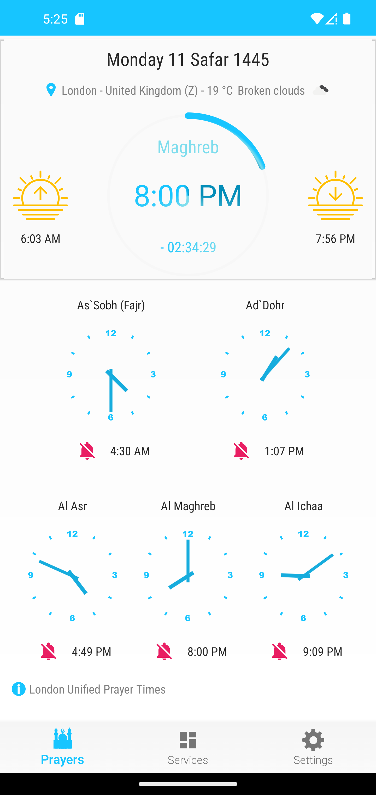
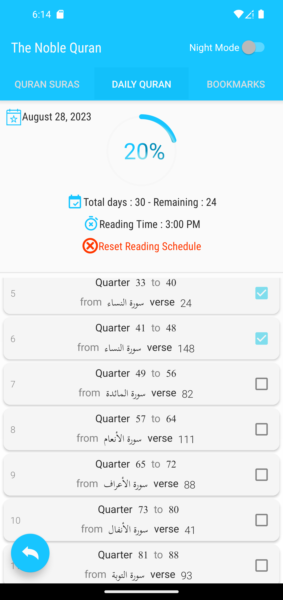

<p align="center"><a href="https://github.com/HichamBI/five-prayers-android"></a></p> 
<h2 align="center"><b>Five Prayers Android</b></h2>
<h4 align="center">A libre lightweight and ads free set of muslim tools</h4>

<p align="center">
<a href="https://github.com/Five-Prayers/five-prayers-android/actions" alt="Build Status" target="_blank"></a>
<a href="https://android-arsenal.com/api?level=16" alt="Min API: 16" target="_blank"></a>
<a href="https://www.gnu.org/licenses/gpl-3.0" alt="License: GPLv3" target="_blank"></a>
 <a href="https://github.com/Five-Prayers/five-prayers-android/branches" alt="Branches" target="_blank"></a>
<a href="https://github.com/Five-Prayers/five-prayers-android/releases/latest" alt="Download: latest version" target="_blank"></a>
 <a href="https://github.com/Five-Prayers/five-prayers-android/releases/latest" alt="Download: latest version" target="_blank"></a>
</p>

<hr>
<p align="center">
<a href="https://play.google.com/store/apps/details?id=com.hbouzidi.fiveprayers" alt="Play Store Link" target="_blank">
  
</a>

F-Droid Repo:<br>
Download the current version by adding the following repo to the F-Droid App
[https://raw.githubusercontent.com/Five-Prayers/fdroid-repo-stable/main/fdroid/repo](https://raw.githubusercontent.com/Five-Prayers/fdroid-repo-stable/main/fdroid/repo)

You can use this fingerprint to valide repo's signature : 

```
C8 E3 6E 27 BA 66 CB 81 D9 24 9C 55 C6 7A 8E 53 21 AF DB CC F8 1E EB 0D 49 5E 8E 3A 01 FE 16 93
```
 
<p align="center">
<a href="https://f-droid.org/fr/packages/com.hbouzidi.fiveprayers" alt="F-Droid Link" target="_blank">
  
</a>
 
</p>

<hr>
<p align="center"><a href="#screenshots">Screenshots</a> &bull; <a href="#description">Description</a> &bull; <a href="#features">Features</a> &bull; <a href="#translating">Translating</a> &bull; <a href="#contributing">Contributing</a></p>
<p align="center"><a href="#publishing-and-using-five-prayers-for-android-code-in-other-projects">Publishing and using Five Prayers</a> &bull; <a href="#open-source-projects-used">Open Source Projects Used</a> &bull; <a href="#privacy-policy">Privacy Policy</a> &bull; <a href="#license">License</a> </p>
<hr>

## Screenshots

[](screenshots/pixel_4xl/Screenshot_0.png)
[](screenshots/pixel_4xl/Screenshot_1.png)
[](screenshots/pixel_4xl/Screenshot_3.png)
[](screenshots/pixel_4xl/Screenshot_4.png)
[](screenshots/pixel_4xl/Screenshot_5.png)
[](screenshots/pixel_4xl/Screenshot_7.png)
[](screenshots/pixel_4xl/Screenshot_8.png)
[](screenshots/pixel_4xl/Screenshot_9.png)
[](screenshots/pixel_4xl/Screenshot_10.png)
[](screenshots/pixel_4xl/Screenshot_12.png)

## Description

Five Prayers Android provide a set of tools needed by any muslim around the world.
Five Prayers Android is not Google Framework dependent, so this app can be used on devices without Google services installed.

### Features

* Worldwide Prayer Times (Online and Offline)

* <details>
  <summary>Different prayer times calculation methods based on <a href="https://aladhan.com">Aladhan.com</a> API</summary>
    
    - Shia Ithna Ashari, Leva Research Institute, Qum
    - University of Islamic Sciences, Karachi
    - Islamic Society of North America (ISNA)
    - Muslim World League (MWL)
    - Umm al-Qura University
    - Egyptian General Authority of Survey
    - Institute of Geophysics, University of Tehran
    - Gulf Region Method
    - Kuwait Method
    - Qatar Method
    - Majlis Ugama Islam - Singapura
    - Jabatan Kemajuan Islam - Malaysia
    - Kementerian Agama RI - Indonesia
    - L'Union des Organisations Islamiques de France (UOIF)
    - Mosquée de Paris - France
    - Angle 18° - France
    - Angle 15° - France
    - Diyanet İşleri Başkanlığı - Turkey
    - Spiritual Administration of Muslims of Russia
    - London Unified Prayer Times
    - Ministry of Islamic Affairs and Habous - Morocco
    - Ministry of religious affairs - Tunisia
    - Ministry of Religious Affairs and wakfs- Algeria
    
</details>

* Prayer times Adjustement
* Hijri Calendar
* Automatic or Manual location
* Notification for prayer times 
* Reads Adhan for prayer times
* Play Adhan from device files
* Read Dua after Adhan
* Reminders before each prayer
* Reminder for Duha prayer
* Switches Adhan to Silent by pressing down volume button
* Month Prayer times table
* Qibla direction compass from [Android Qibla Direction](https://github.com/hassaanjamil/hj-android-lib-qibla-direction)
* Quran (Please consider this open-source project if your are looking for more features [Quran Android](https://github.com/quran/quran_android))
* 99 Names of God
* Home Screen Widget
* Dark Themes

## Translating

Do you want to help Five Prayers Android becoming international ?
Five Prayers Android currently supports [the following languages]( app/src/main/res).

To add a new translation just add a pull request with a new `strings.xml` file inside a `values-xx` folder (where `xx` is a [two-letter ISO 639-1 language code](https://en.wikipedia.org/wiki/ISO_639-1)).

An updated version of the English version translation is [available here](app/src/main/res/values/strings.xml).

If a translation in your language is already available, please check it and eventually fix it (all the strings should be listed, not just a subset).

## Contributing

Feel free to open issues/pull requests to help me improve this project.

When reporting a new Issue, make sure to attach Screenshots, Videos or GIFs of the problem you are reporting.
When submitting a new PR, make sure tests are all green. Write new tests if necessary.

## Privacy Policy

Five Prayers Android project aims to provide a private, anonymous and ads free experience for all users.Therefore, the app does not collect any data without your consent.
We process and store data based on the EU General Data Protection Regulation (Regulation (EU).

The following section fulfills the requirements of the GDPR Articles 13 and 14, and informs you about the collection and processing of personal data within our project.

#### Bug report tracking system

To help Five Prayers Android's improving and fixing bugs, we implemented a bug reporting system to allow user to send a crash report :  When Five Prayers Android crashes on a device, the user is shown a dialog containing a summary of the information about the bug. The user can opt to send the full details to us. When a user clicks the send button, Five Prayers Android composes an e-mail via the Android system containing the details in a machine-readable format called JSON. JSON is a text-based format, allowing users to read the data and check exactly what data could be sent to us. Users can remove or anonymize data which they do not want to be shared.

The JSON part contains the following information:

   - the e-mail address of the sender
   - the type/name of the error
   - the system language
   - time of the incident
   - version of the application
   - operating system name, version and API level
   - the error protocol (stacktrace)
   - user comment

Our bug reporting code is implemented to not embed any personal data. However, we cannot guarantee that there won't be any personal data contained by accident. Also, we cannot control whether the user will add any personal data to the generated JSON, nor can we control whether users add personal data outside it. Therefore we tried to implement our bug report system as transparently as possible, allowing the user to entirely control what data is sent. We assume that by sending an actual e-mail to the crash reporting system's address, any personal data is sent on behalf and with consent of the user. The e-mails are stored on a Google mail server, and won't be deleted before bug analysing takes place.
Any additional text in the e-mail that is not part of the JSON section is considered a user comment and will be processed and stored by us as well.

Only a small circle of people has access to the bug repport email. We instruct every user to delete any report which contains personal data as soon as it is discovered. We ask you to ensure you don't send us any personal data you don't want to share with us. We consider any content in the e-mails to be sent with your consent. You may, at any time, request deletion of the data. Please see below for your rights as a user.

#### Users' rights

   - Every user has the right to request details about the personal data stored about them according to GDPR Art. 15.
   - Every user has the right to request the correction or completion (GDPR Art. 16) or deletion (GDPR Art. 17) or restriction of use (GDPR Art. 18) of the data sent to us at any time.
   - According to GDPR Art. 77, you may, at any time, file a complaint about our data processing at your local data protection officer.
   - According to GDPR Art. 7 paragraph 3, you may revoke any consent you gave us about storing and processing data at any time for future time.
   - According to GDPR Art. 21, you may at any time dissent the processing and storing of data listed in the article.


## Publishing and using Five Prayers for Android code in other projects

The intention behind open sourcing Five Prayers for Android is two fold - first, to spare people from intrusive, annoying and invasive advertisements. Second to allow developers to help contribute to the app, thus speeding up the development of new features and ideas.

Therefore, people planning on taking this project and profiting from it (by way of ads, in app purchases, etc) are in fact breaking his mainspring.

Please keep use of this code for non-profit purposes only. Also, please note that the project is under the GPL 3 license, which requires that modifications to this code be open sourced as well. Please note that the data is licensed under the various licenses of the data's authors (typically, this is [CC BY-NC-ND](https://creativecommons.org/licenses/by-nc-nd/2.0/), but may differ depending on the source of the data).

## Open Source Projects Used

* [AndroidX](https://developer.android.com/jetpack/androidx/)
* [Material Design Components](https://github.com/material-components/material-components-android)
* [OkHttp](https://github.com/square/okhttp)
* [RxJava 3](https://github.com/ReactiveX/RxJava)
* [RxAndroid](https://github.com/ReactiveX/RxAndroid)
* [Circular Progress Bar](https://github.com/lopspower/CircularProgressBar)
* [Skeleton Layout](https://github.com/Faltenreich/SkeletonLayout)
* [TableView](https://github.com/evrencoskun/TableView)
* [GifView](https://github.com/Cutta/GifView)
* [NumberPicker](https://github.com/travijuu/NumberPicker)
* [CalendarView](https://github.com/kizitonwose/CalendarView)
* [AppIntro](https://github.com/AppIntro/AppIntro)
* [CustomActivityOnCrash](https://github.com/Ereza/CustomActivityOnCrash)
* [LovelyDialog](https://github.com/yarolegovich/LovelyDialog)
* [Android Qibla Direction](https://github.com/hassaanjamil/hj-android-lib-qibla-direction)
* [Quran Android](https://github.com/quran/quran_android)
* [PrimeCalendar](https://github.com/aminography/PrimeCalendar)
* [Adhan Java](https://github.com/batoulapps/adhan-java)

## License
[](http://www.gnu.org/licenses/gpl-3.0.en.html)  

Five Prayers Android is Free Software: You can use, study share and improve it at your
will. Specifically you can redistribute and/or modify it under the terms of the
[GNU General Public License](https://www.gnu.org/licenses/gpl.html) as
published by the Free Software Foundation, either version 3 of the License, or
(at your option) any later version.
